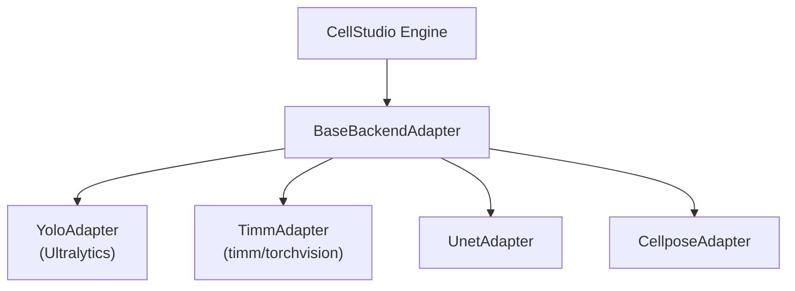

# Backend Adapters

Backend adapters form the anti-corruption layer between CellStudio's
engine and third-party model frameworks.

## Architecture



## BaseBackendAdapter

::: cellstudio.backends.base.adapter.BaseBackendAdapter

## Supported Backends

| Backend Key | Adapter Class | Framework | Tasks |
|---|---|---|---|
| `yolo` / `ultralytics` | `YoloAdapter` | Ultralytics | Detection, Classification |
| `timm` | `TimmAdapter` | PyTorch Image Models | Classification |
| `unet` | `UnetAdapter` | Custom PyTorch | Segmentation |
| `cellpose` | `CellposeAdapter` | Cellpose | Segmentation |

## Backend Registry

The `BackendAdapterRegistry` in `cellstudio/backends/registry.py`
routes string backend names to adapter classes:

```python
from cellstudio.backends.registry import BackendAdapterRegistry

adapter = BackendAdapterRegistry.get('yolo', config, device='cuda')
result = adapter.train(data_path='data/mido.json')
```

## Implementing a New Backend

1. Subclass `BaseBackendAdapter`
2. Implement `_build_model()`, `train()`, `evaluate()`, `predict()`, `export()`
3. Register in `BackendAdapterRegistry._adapters`
