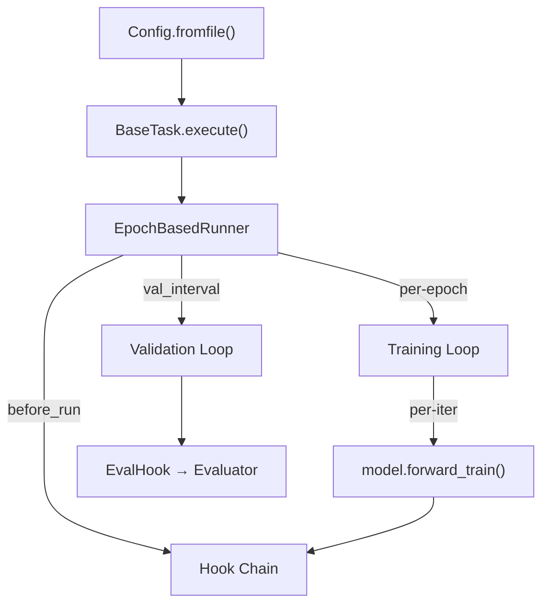

# Engine — Runner, Hooks & Config

The engine module is the heart of CellStudio's training/evaluation lifecycle.

## Architecture Overview



## Config (`cellstudio.engine.config`)

::: cellstudio.engine.config.config.Config

### Usage

```python
from cellstudio.engine.config.config import Config

cfg = Config.fromfile('configs/detect/yolo_v8m_det_mido.yaml')
print(cfg.model.type)       # 'UltralyticsDetAdapter'
print(cfg.runner.max_epochs) # 100
```

Config files support `_base_` inheritance — child configs override parent values:

```yaml
_base_: '../_base_/default_runtime.yaml'
model:
  type: UltralyticsDetAdapter
  yaml_model: yolov8m.pt
```

---

## BaseRunner (`cellstudio.engine.runner`)

::: cellstudio.engine.runner.base_runner.BaseRunner

### Lifecycle Events

| Event | When | Typical Hook Use |
|---|---|---|
| `before_run` | Once before training starts | Logger setup, timer init |
| `before_train_epoch` | Start of each epoch | — |
| `before_train_iter` | Before each forward pass | Start iter timer |
| `after_train_iter` | After backward + step | Logging, grad clip |
| `after_train_epoch` | End of each epoch | Checkpoint save |
| `before_val_epoch` | Start of validation | — |
| `after_val_iter` | After each val batch | Accumulate predictions |
| `after_val_epoch` | End of validation | Compute metrics, save best |
| `after_run` | Once after all epochs | Cleanup, final plots |

---

## EpochBasedRunner

::: cellstudio.engine.runner.epoch_runner.EpochBasedRunner

---

## Hook System (`cellstudio.engine.hooks`)

### Base Hook Interface

::: cellstudio.engine.hooks.base.Hook

### Built-in Hooks

| Hook | Registry Name | Purpose |
|---|---|---|
| `TextLoggerHook` | `TextLoggerHook` | Console + file logging with JSON scalars |
| `AmpOptimizerHook` | `AmpOptimizerHook` | Backward pass, grad clipping, AMP scaling |
| `CheckpointHook` | `CheckpointHook` | Save `latest.pth` and `best.pth` |
| `EvalHook` | `EvalHook` | Bridge between Runner and Evaluator |
| `EMAHook` | `EMAHook` | Exponential moving average of model weights |
| `TrainingProgressPlotterHook` | — | End-of-run training curve visualization |
