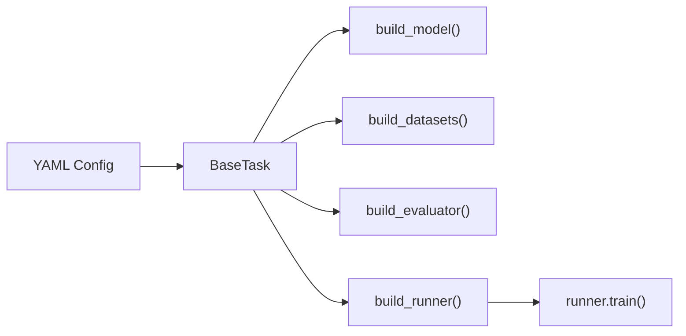

# Tasks

Tasks are the top-level orchestrators that compose Runner, Datasets,
Model, Evaluator, and Hooks from a single YAML configuration.

## Architecture



## BaseTask

::: cellstudio.tasks.base.BaseTask

## Concrete Tasks

### ClassificationTask

Registered as `ClassificationTask`. Builds `StandardClassificationDataset`
from config and wires up train/val DataLoaders.

### ObjectDetectionTask

Registered as `ObjectDetectionTask`. Supports both `MIDODataset` (full
images) and `TileMIDODataset` (tiled WSI patches).

### InstanceSegmentationTask

Registered as `InstanceSegmentationTask`. Supports
`CellposeSegmentationDataset` with instance mask loading.

## Task Registry

All tasks register via:

```python
from cellstudio.tasks.registry import TASK_REGISTRY

@TASK_REGISTRY.register('MyCustomTask')
class MyCustomTask(BaseTask):
    def build_datasets(self):
        ...
```
